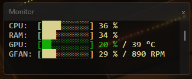

# System Resources Monitor
Displays real-time CPU, RAM, GPU and GPU fan usage in a compact format.

# Features
- Real-time monitoring: CPU, RAM, GPU, and GPU Fan speed.
- Compact UI: Clean & cozy terminal output.
- Fast: Built with C++ for high performance.
- Lightweight: Low CPU/RAM overhead

# Requirements
- **Platform**: Windows 10, 11(need set old terminal in settings)
- **GPU**: Nvidia RTX 2060 

# Usage
Download the latest .exe from the releases page.

